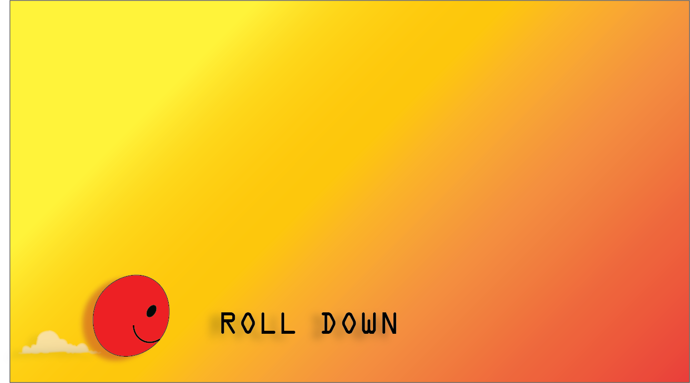

# Game

# Game Description
1. It is a game made with HTML, CSS and JavaScript.
2. There are blocks that emerge from bottom of the ball, on which ball have to maintain itself.
3. If ball is not maintained on the blocks then the game is over.
4. If ball goes out of the screen from above then also the game is over.
5. It is a very basic and fun game to kill boredom.
